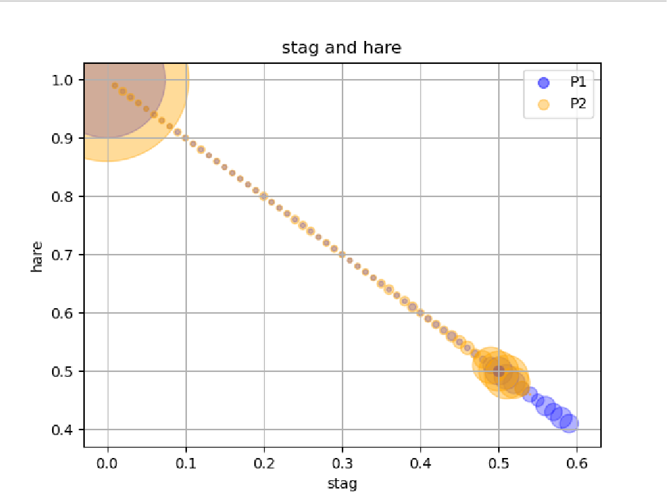
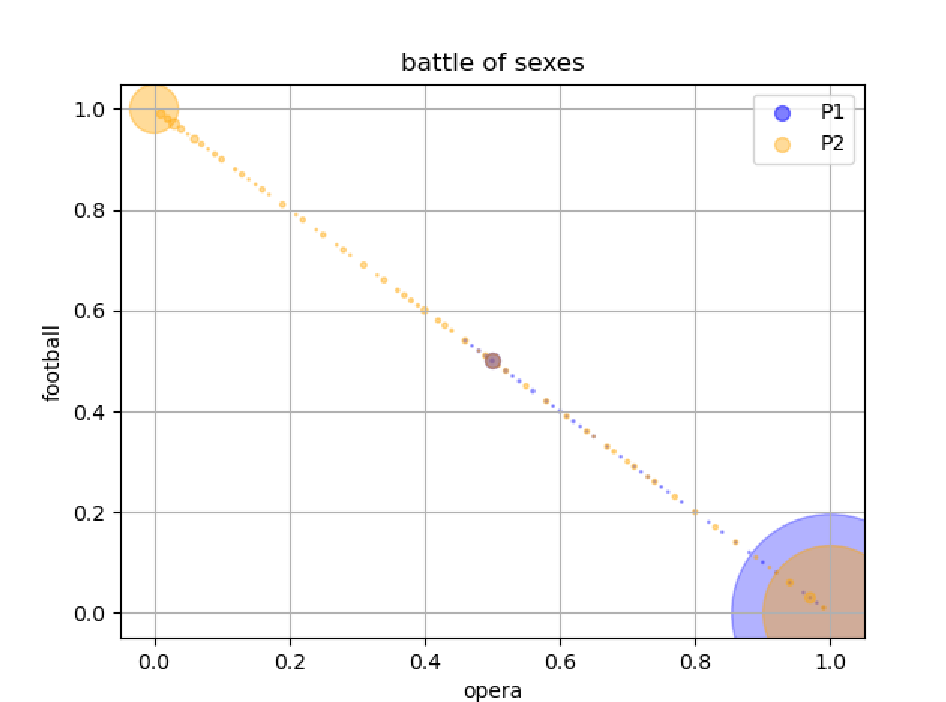
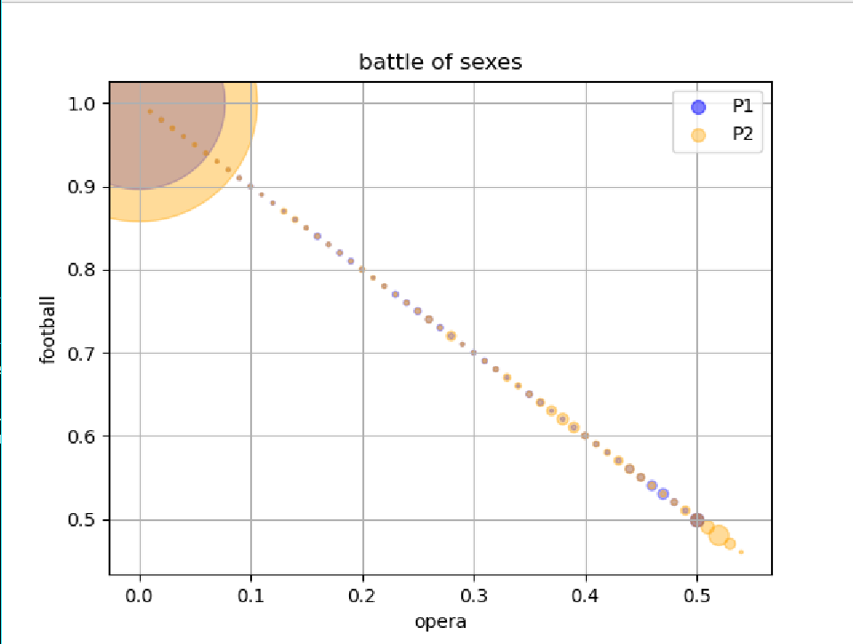

# Nash Equilibria Through Simulation

### Purpose:
Finding the Nash equilibrium of a two player game through simulation. Simulates three 2-option games: prisoner's dilemma, stag and hare, and battle of sexes. 

### To Run:
Ran through command line (python Main.py text.txt). text.txt is a text file with the number of options of the game, name of the game, and payoff matrix for the game.  

### Graphical Interpretation: 
The convergence on the equilibrium strategy is represented by the probability of a player playing that strategy. The graphical outputs of the program demonstrate the amount of times that a player landed on a probability for a certain option. The x and y axes are the two strategies, the two colors are for players 1 and 2, and the size of each data point represents the frequency with which a probability for a strategy appeared for a player. 

### Examples 
The program runs 50 trials of 10-player round robin, and the generated graphs show a convergence towards an equilibrium. However, for the stag and hare game especially, one of the equilibria is lost using this few trials. The examples below are graphs generated using a slower rate of preference updating (.001 instead of .01) and 1000 trials of 10-player round robin.

#### Prisoner's Dilemma 

#### Stag and Hare 

#### Battle of Sexes (two possible convergences)

